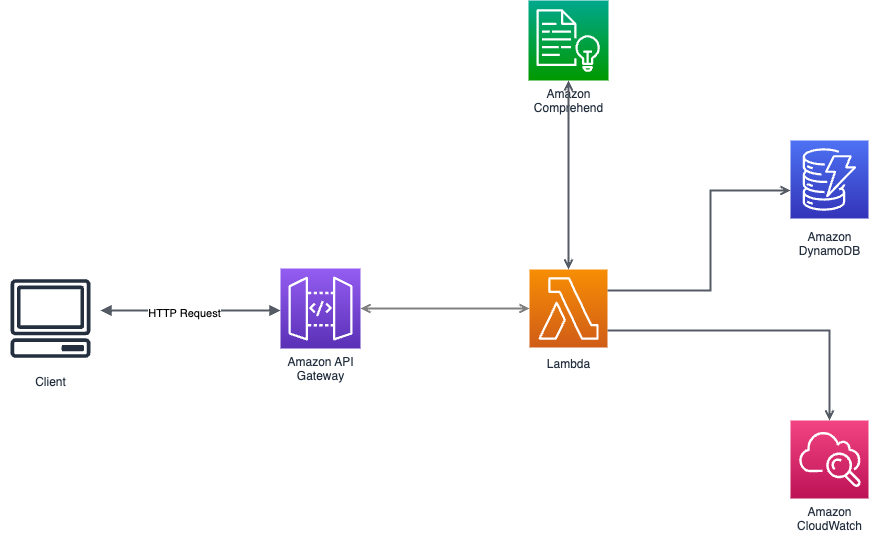

# Serverless Sentiment Analysis for Customer Feedback
This serverless REST API gets integrated with  web applications that allows users to submit customer feedback and automatically analyzes the sentiment of the feedback. It leverages AWS Lambda, API Gateway, DynamoDB, and Amazon Comprehend.

## Architecture 

## Features
- Collect customer feedback via a web interface
- Sentiment analysis (positive, negative, neutral, mixed) using Amazon Comprehend
- Store feedback and analysis results in DynamoDB
- Optional real-time dashboard for visualizing overall sentiment trends

## Endpoints
POST`/feedback-analysis`: sends feedback to Amazon comprehend for sentiment analysis
 
Request body 
 
`
{
  "feedback": "some feedback text",
  "language_code": en | fr| de | ja | etc
}
`
  
GET`/feedback-analysis`: Retrieve all the analysed feedbacks stored in DynamoDB

## **DynamoDB Items**

| Attribute        | Data Type  | Description                                |
|------------------|------------|--------------------------------------------|
| `FeedbackID`     | `String`   | Unique ID for each feedback                |
| `UserFeedback`   | `String`   | The actual feedback text from the user     |
| `SentimentScore` | `Number`   | The sentiment score calculated by Comprehend |
| `SentimentLabel` | `String`   | Sentiment label (Positive, Negative, Neutral, Mixed) |
| `Timestamp`      | `String`   | Time when the feedback was submitted       |

## License
This project is licensed under the MIT License - see the LICENSE file for details.