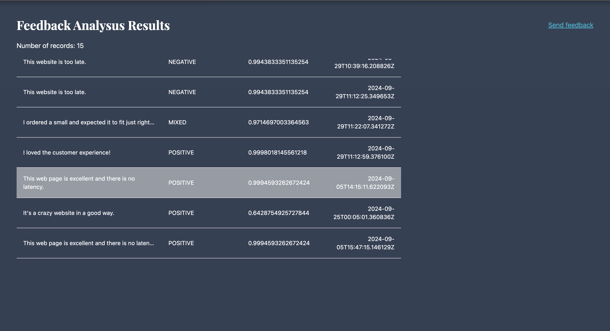

# Feedback Sentiment Analysis Frontend with React 

`/feedback`  
This page is the home page for sending feedbacks and showing the result.  

`/results`  
This page shows the records of feedbacks that were analysed by Amazon Comprehend.  
